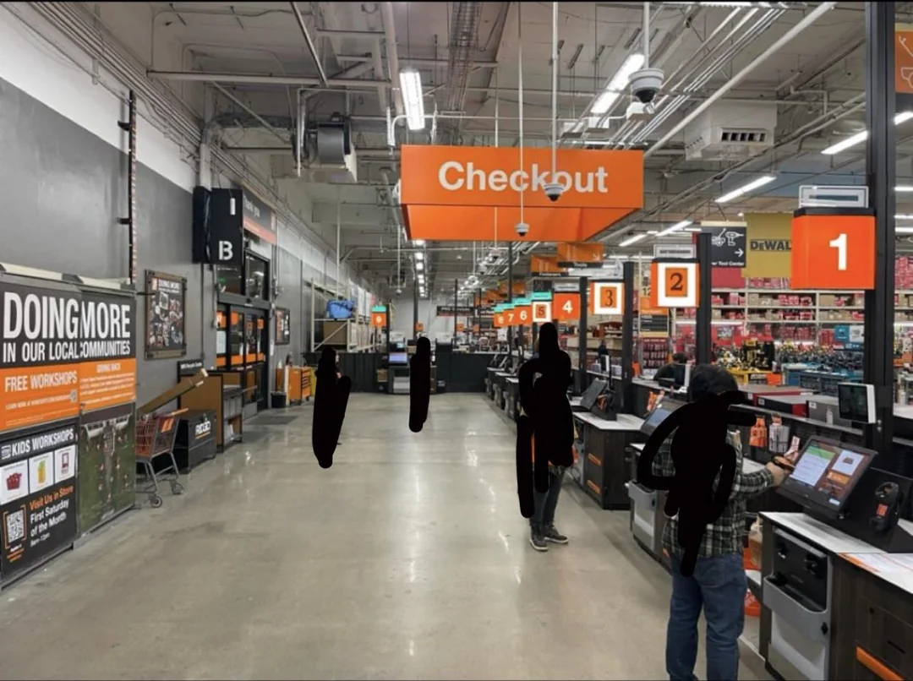
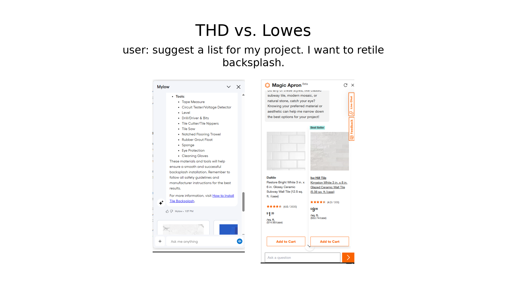
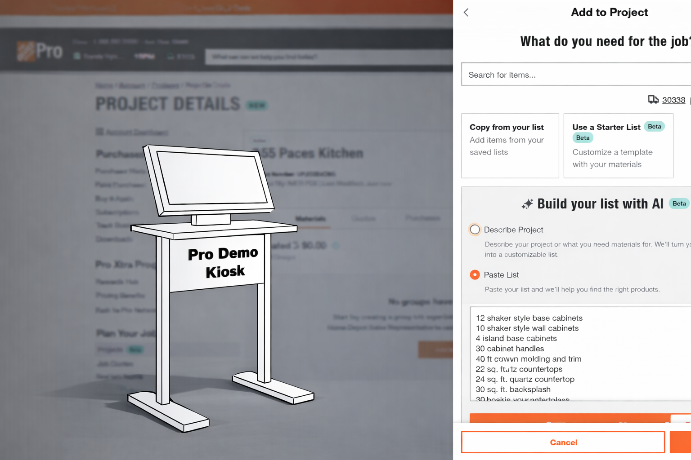

# PACE (2026): Hsien Tang Chen
- Poway HomeDepot

- access this page: https://github.com/UObrev/2026-PACE

## What Went Well

## I feel positive on Team and Tools
-   **OrderUp** -- Strong tool. I've learned to use it efficiently and
    continue finding better ways to work inside it.\
-   **Fulfillment Team** -- Reliable, fast under short deadlines, and
    willing to support Special Services when needed.\
-   **MET Team** -- Consistently reset the floor (Halloween → Christmas
    → Spring) smoothly and professionally. Big visible impact.

---

## 👀 I see Leadership

- **Dept 31** – Solid coaching. Real team building.  
- **David on HD phone** – “Let’s keep the phone on. Let's talk and reply over the phone. Lets make today a win day.”  
  That’s leadership. That’s orchestra energy.

---

## 📈 I see the value of Peformance Guidelines

- **LTPA Reviews** – Asking for LTPA reviews anchors performance and reinforces customer experience.  
- **Entrance Greeting Practice** – Strong first impression; improves in-store experience and opens sales opportunities.  

---

## Went Not So Well (this to share my thoughts...)

---
### 🛠 Improve Accuracy + Tool Familiarity

- Get sharper with Tools: OrderUp, Return One, Pro Xtra, SPOS  
- Continuously improve accuracy.  
- Understand Rental system workflow end-to-end

### 🌐 Understand the THD Ecosystem

- Deep dive into service providers + vendors  
- Understand logistics flow (who moves what, how, and when)  
- Learn full store workflow — not just Service Desk bubble  
- See how all pieces connect

### Gain Race Track Smart and Become Aisle Proficient

- Answer customer questions with confidence + accuracy  
- Know where frequent commodities are — no guessing
- Stay alert on seasonal pushes

### Prep for EVgo Walk-Ins

- EVgo chargers -> more walk-ins. Would be nice if we could prep D-31 for that opportunity.

- Suggest flyers and posters: key message "THD Efficiency: Charge your car. Get ready for your home project — all at the same time."

- Would be nice if we could explore the "EVgo-side" service concept.

### Remap the "Cold Corridor" 

- Corridor behind ice chest wall = low energy, low SKU motion.

- Would be nice if we could use it to expand DIY Self Checkout.

- I feel Mira Mesa store did a good job in this area.

### Need to Lower BRC counts

- BRC = Backup Request Calls. When surge in return line, we ring BRC.

- Before: it took 1.5 to 2 calls to get backup. Now: 4+ calls.

- I feel we are slipping here. Needs reinforcement.

### 🎼 "On My Way" Reply = Orchestra

- We all carry HD phones. Calls heard by assoc and cust in store.  
- Many assoc don’t reply. No reply = off-beat music in the store.
- “On my way.” reply → Orchestra = Synced and Harmony.
- I feel MOD could do a better job to reinfocre. 

### "Not Seeing the Elephant in the Room" (AI)

-   HD.com has at least two AI chat tools.
-   I've used them at work. Helpful.
-   It is 2026, No real in-store rollout yet.
-   I fear that Lowes (OpenAI partnership) may gain upper hand
-   Would be nice if we could address this before it becomes reactive.

### Pro Demo Kiosk

- THD rolling out new AI tools; latest launched end of Jan.
- I spoke with many Pros--many display strong interest in AI tool. 
- I recommend to set up a kiosk in store.

---

## Something for me to Pick Up:

- **Rental Department** – Want to know how tools work.  
- Expand skill set.  
- Explore Pro Demo Kiosk idea with team.
- Explore EVgo-side/THD Efficiecy flyer idea with team.

---

## Next 6 Months Goals

-   Continue improving OrderUp efficiency and resolution speed.\
-   Monitor Corporate AI direction and Pro customer response.\

------------------------------------------------------------------------

## Support Requested

- Let me help tame the Elephant (practical use, to start with Pros!).
- Encourage MOD to play Conducutor and keep the in-store Orchestra. 
- Up my pay scale, please :-)
